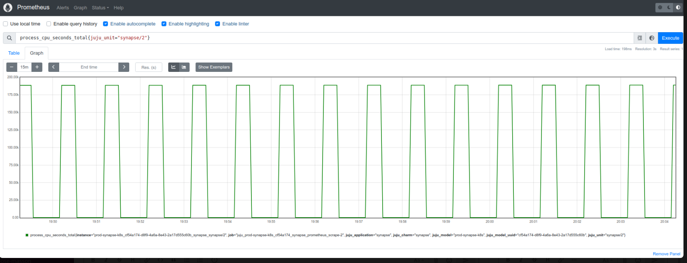
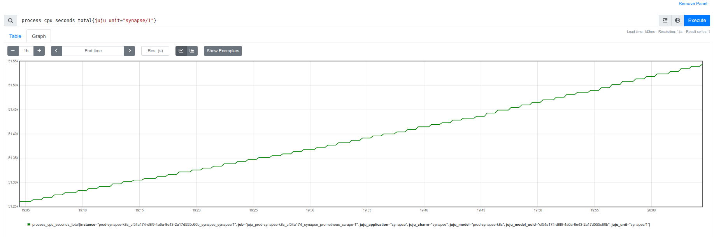

+++
title = 'Prometheus estranho: detalhes sobre process_cpu_seconds_total'
date = 2024-09-11T11:20:50-03:00
draft = false
+++

**Objetivo:** Detectar causa de comportamento estranho em métrica no Prometheus.

Surgiu no trabalho uma situação curiosa com a monitoração de uma aplicação.

No painel de uso de CPU disponível no dashboard Grafana, aparecia um gráfico
subindo sem parar com números absurdos.

A métrica utilizada é `process_cpu_seconds_total` coletada e disponibilizada
pelo client Python do Prometheus.

Esse client coleta a informação do arquivo `/proc/[pid]/statstat` onde pid é o
id do processo monitorado.

Essa métrica pode ser lida como "quantos segundos minha aplicação utilizou na
CPU desde que iniciou". Por isso, faz sentido ela ser um Counter, ou seja, ela
só aumenta.

Assim, para calcular a porcentagem uso de CPU, utiliza-se a query abaixo ("myjob"
é só um exemplo):

```
rate(process_cpu_seconds_total{job="myjob"}[5m]) * 100
```

Essa query pode ser lida como "taxa média de segundos de CPU consumidos por
segundo pelo processo nos últimos 5 minutos".

Considerando que um segundo de CPU consumido por segundo é 100% do uso de um
núcleo de CPU, podemos multiplicar esse valor por 100 e então obter a
porcentagem de uso de CPU.

Ao investigar o problema, vi que o gráfico da métrica coletada pelo Prometheus
estava assim:



O esperado seria algo assim:



**Solução:**

Após elaborar teorias a respeito da quantidade de cores estar afetando a coleta
da aplicação, enfim descobri o problema: outro target estava enviando a mesma
métrica com os mesmos labels!

Isso aconteceu porque a aplicação estava sendo monitorada no mesmo job com dois
targets diferentes, então a métrica era a mesma, gerando essa bagunça de valores.

O que poderia ter causado também seria um constant restart da aplicação, fazendo
com que o gráfico mostrasse o consumo inicial até ser reiniciada e começar tudo
de novo.

A solução foi criar jobs separados para coletar as métricas, evitando assim que
uma sobrescrevesse a outra.

**Referências:**

- [Parte do código](https://github.com/prometheus/client_python/blob/master/prometheus_client/process_collector.py#L62) onde Prometheus Python Client coleta CPU.
- O que é [Counter](https://prometheus.io/docs/concepts/metric_types/#counter) na documentação do Prometheus (em inglês).
- ["Calculate the Total CPU Usage of a Process From /proc/pid/stat"](https://www.baeldung.com/linux/total-process-cpu-usage). Artigo interessante sobre como coletar uso de CPU via shell script (em inglês)
